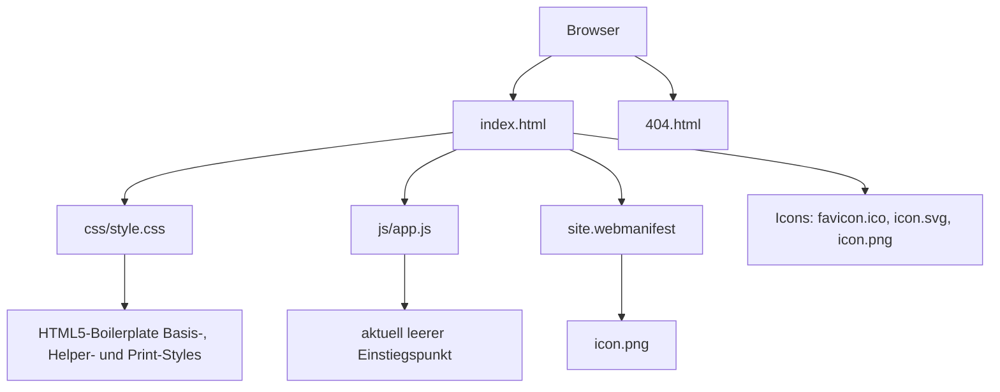
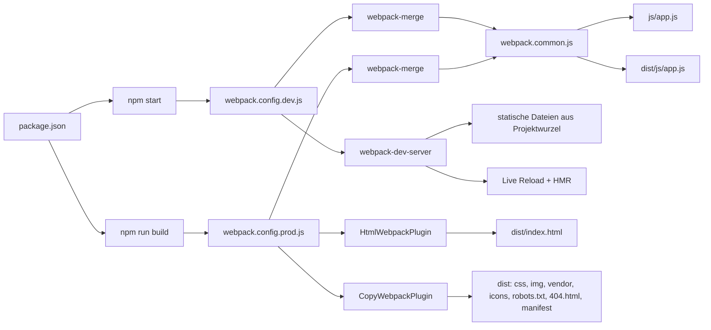
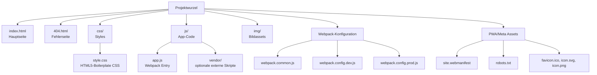

# Projektvisualisierung

## Laufzeitstruktur

```mermaid
flowchart TD
  Browser[Browser] --> Index[index.html]
  Browser --> NotFound[404.html]

  Index --> Style[css/style.css]
  Index --> App[js/app.js]
  Index --> Manifest[site.webmanifest]
  Index --> Icons[Icons: favicon.ico, icon.svg, icon.png]

  Manifest --> IconPng[icon.png]
  Style --> BoilerplateStyles[HTML5-Boilerplate Basis-, Helper- und Print-Styles]
  App --> EmptyApp[aktuell leerer Einstiegspunkt]
```

## Build- und Entwicklungsfluss

```mermaid
flowchart LR
  Package[package.json] --> Start[npm start]
  Package --> Build[npm run build]

  Start --> DevConfig[webpack.config.dev.js]
  Build --> ProdConfig[webpack.config.prod.js]

  DevConfig --> MergeDev[webpack-merge]
  ProdConfig --> MergeProd[webpack-merge]

  MergeDev --> Common[webpack.common.js]
  MergeProd --> Common

  Common --> Entry[js/app.js]
  Common --> DistJs[dist/js/app.js]

  DevConfig --> DevServer[webpack-dev-server]
  DevServer --> StaticRoot[statische Dateien aus Projektwurzel]
  DevServer --> LiveReload[Live Reload + HMR]

  ProdConfig --> HtmlPlugin[HtmlWebpackPlugin]
  ProdConfig --> CopyPlugin[CopyWebpackPlugin]

  HtmlPlugin --> DistIndex[dist/index.html]
  CopyPlugin --> DistAssets[dist: css, img, vendor, icons, robots.txt, 404.html, manifest]
```

## Dateirollen

```mermaid
flowchart TB
  Root[Projektwurzel]

  Root --> Html[index.html<br/>Hauptseite]
  Root --> ErrorPage[404.html<br/>Fehlerseite]
  Root --> CssDir[css/<br/>Styles]
  Root --> JsDir[js/<br/>App-Code]
  Root --> ImgDir[img/<br/>Bildassets]
  Root --> Config[Webpack-Konfiguration]
  Root --> Pwa[PWA/Meta Assets]

  CssDir --> Css[style.css<br/>HTML5-Boilerplate CSS]
  JsDir --> Js[app.js<br/>Webpack Entry]
  JsDir --> Vendor[vendor/<br/>optionale externe Skripte]
  Config --> CommonCfg[webpack.common.js]
  Config --> DevCfg[webpack.config.dev.js]
  Config --> ProdCfg[webpack.config.prod.js]
  Pwa --> ManifestFile[site.webmanifest]
  Pwa --> Robots[robots.txt]
  Pwa --> IconFiles[favicon.ico, icon.svg, icon.png]
```
